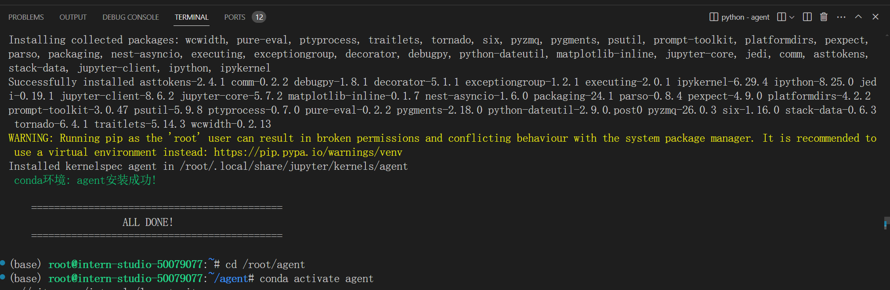

# InternLM2实战营第二期

## 第六节课 《Lagent & AgentLego 智能体应用搭建》
官网地址：[书生·浦语官网](https://internlm.intern-ai.org.cn/)  
课程录播视频链接地址：[Lagent & AgentLego 智能体应用搭建_bilibili](https://www.bilibili.com/video/BV1Xt4217728/)   


### 1.视频笔记

为什么要有智能体？


智能体的组成


智能体的三种范式


接下来就是介绍Lagent和AgentLego智能体


两者之间的关系


### 2.接下来实战部分

#### 2.1环境安装

首先先提供官网指导文档：[Lagent AgentLego智能体应用搭建](https://github.com/InternLM/Tutorial/tree/camp2/agentLagent AgentLego智能体应用搭建)

这里会简单介绍Lagent个AgentLego，详细请看官方文档。

Lagent是一个轻量级的开源智能体框架，目的是让用户可以高效的建立基于大语言模型的智能体。同时也提供了一些工具增强模型的性能。比如

- Arxiv 搜索
- Bing 地图
- Google 学术搜索
- Google 搜索
- 交互式 IPython 解释器
- IPython 解释器
- PPT
- Python 解释器

AgentLego是一个提供了多种开源工具API的多模态工具包，目的是类似乐高积木一样，方便用户可以快速简单的自定义工具，组装出自己的智能体。

AgentLego 目前提供了如下工具：


| 通用能力       | 语音相关                               | 图像处理                                                     | AIGC                                                         |
| -------------- | -------------------------------------- | ------------------------------------------------------------ | ------------------------------------------------------------ |
| 计算器谷歌搜索 | 文本 -> 音频（TTS）音频 -> 文本（STT） | 描述输入图像识别文本（OCR）视觉问答（VQA）人体姿态估计人脸关键点检测图像边缘提取（Canny）深度图生成生成涂鸦（Scribble）检测全部目标检测给定目标SAM分割一切分割给定目标 | 文生图图像拓展删除给定对象替换给定对象根据指令修改ControlNet 系列根据边缘+描述生成根据深度图+描述生成根据姿态+描述生成根据涂鸦+描述生成ImageBind 系列音频生成图像热成像生成图像音频+图像生成图像音频+文本生成图像 |

 两者的关系？

经过上面的介绍，我们可以发现，Lagent 是一个智能体框架，而 AgentLego 与大模型智能体并不直接相关，而是作为工具包，在相关智能体的功能支持模块发挥作用。

还是和之前张杰一样，创建开发机和conda环境（Cuda12.2-conda和GPU为30%的A100）即可。详细操作流程稍后会以指令代码和截图方式展示。

```python
# 指定路径root下创建一个agent目录
mkdir -p /root/agent
# 配置conda环境，并且命名为agent
studio-conda -t agent -o pytorch-2.1.2


# 非InterStudio开发机环境配置
# conda create -n agent
# conda activate agent
# conda install python=3.10
# conda install pytorch==2.1.2 torchvision==0.16.2 torchaudio==2.1.2 pytorch-cuda=11.8 -c pytorch -c nvidia
```




Lagent 和 AgentLego 都提供了两种安装方法，一种是通过 pip 直接进行安装，另一种则是从源码进行安装。为了方便使用 Lagent 的 Web Demo 以及 AgentLego 的 WebUI，我们选择直接从源码进行安装。 此处附上源码安装的相关帮助文档：

- Lagent：https://lagent.readthedocs.io/zh-cn/latest/get_started/install.html

- AgentLego：https://agentlego.readthedocs.io/zh-cn/latest/get_started.html

命令安装：

```python
# 安装Lagent和AgentLego
cd /root/agent
conda activate agent
git clone https://gitee.com/internlm/lagent.git
cd lagent && git checkout 581d9fb && pip install -e . && cd ..
git clone https://gitee.com/internlm/agentlego.git
cd agentlego && git checkout 7769e0d && pip install -e . && cd ..

# 安装其他依赖
conda activate agent
pip install lmdeploy==0.3.0

# 安装Tutorial
cd /root/agent
git clone -b camp2 https://gitee.com/internlm/Tutorial.git
```


### 开启Lagent web demo的部署

由于 Lagent 的 Web Demo 需要用到 LMDeploy 所启动的 api_server，因此我们首先按照下图指示在 vscode terminal 中执行如下代码使用 LMDeploy 启动一个 api_server。

```python
conda activate agent
lmdeploy serve api_server /root/share/new_models/Shanghai_AI_Laboratory/internlm2-chat-7b \
                            --server-name 127.0.0.1 \
                            --model-name internlm2-chat-7b \
                            --cache-max-entry-count 0.1
```


启动并且使用Lagent web demo，新建一个terminal终端。

```python
conda activate agent
cd /root/agent/lagent/examples
streamlit run internlm2_agent_web_demo.py --server.address 127.0.0.1 --server.port 7860
```


然后就是我们本地打开cmd去进行端口映射了，将 LMDeploy api_server 的23333端口以及 Lagent Web Demo 的7860端口映射到本地。可以执行。

```python
ssh -CNg -L 7860:127.0.0.1:7860 -L 23333:127.0.0.1:23333 root@ssh.intern-ai.org.cn -p 你的 ssh 端口号
```


然后在本地浏览器输入http://127.0.0.1:7860/ 即可访问Lagent web demo智能体，并且输入模型 IP 为 127.0.0.1:23333，在输入完成后按下回车键以确认。并选择插件为 ArxivSearch，以让模型获得在 arxiv 上搜索论文的能力。


**下一小节是体验自定义天气预报功能效果，请将刚才的两个终端关闭，避免后面出现out of memory或者端口被占用的情况出现**

## 用 Lagent 自定义工具

在本节中，我们将基于 Lagent 自定义一个工具。Lagent 中关于工具部分的介绍文档位于 https://lagent.readthedocs.io/zh-cn/latest/tutorials/action.html 。使用 Lagent 自定义工具主要分为以下几步：

1. 继承 BaseAction 类
2. 实现简单工具的 run 方法；或者实现工具包内每个子工具的功能
3. 简单工具的 run 方法可选被 tool_api 装饰；工具包内每个子工具的功能都需要被 tool_api 装饰

下面我们将实现一个调用和风天气 API 的工具以完成实时天气查询的功能。

### 2.1 创建工具文件

首先通过 `touch /root/agent/lagent/lagent/actions/weather.py`（大小写敏感）新建工具文件，该文件内容如下：

```
import json
import os
import requests
from typing import Optional, Type

from lagent.actions.base_action import BaseAction, tool_api
from lagent.actions.parser import BaseParser, JsonParser
from lagent.schema import ActionReturn, ActionStatusCode

class WeatherQuery(BaseAction):
    """Weather plugin for querying weather information."""
    
    def __init__(self,
                 key: Optional[str] = None,
                 description: Optional[dict] = None,
                 parser: Type[BaseParser] = JsonParser,
                 enable: bool = True) -> None:
        super().__init__(description, parser, enable)
        key = os.environ.get('WEATHER_API_KEY', key)
        if key is None:
            raise ValueError(
                'Please set Weather API key either in the environment '
                'as WEATHER_API_KEY or pass it as `key`')
        self.key = key
        self.location_query_url = 'https://geoapi.qweather.com/v2/city/lookup'
        self.weather_query_url = 'https://devapi.qweather.com/v7/weather/now'

    @tool_api
    def run(self, query: str) -> ActionReturn:
        """一个天气查询API。可以根据城市名查询天气信息。
        
        Args:
            query (:class:`str`): The city name to query.
        """
        tool_return = ActionReturn(type=self.name)
        status_code, response = self._search(query)
        if status_code == -1:
            tool_return.errmsg = response
            tool_return.state = ActionStatusCode.HTTP_ERROR
        elif status_code == 200:
            parsed_res = self._parse_results(response)
            tool_return.result = [dict(type='text', content=str(parsed_res))]
            tool_return.state = ActionStatusCode.SUCCESS
        else:
            tool_return.errmsg = str(status_code)
            tool_return.state = ActionStatusCode.API_ERROR
        return tool_return
    
    def _parse_results(self, results: dict) -> str:
        """Parse the weather results from QWeather API.
        
        Args:
            results (dict): The weather content from QWeather API
                in json format.
        
        Returns:
            str: The parsed weather results.
        """
        now = results['now']
        data = [
            f'数据观测时间: {now["obsTime"]}',
            f'温度: {now["temp"]}°C',
            f'体感温度: {now["feelsLike"]}°C',
            f'天气: {now["text"]}',
            f'风向: {now["windDir"]}，角度为 {now["wind360"]}°',
            f'风力等级: {now["windScale"]}，风速为 {now["windSpeed"]} km/h',
            f'相对湿度: {now["humidity"]}',
            f'当前小时累计降水量: {now["precip"]} mm',
            f'大气压强: {now["pressure"]} 百帕',
            f'能见度: {now["vis"]} km',
        ]
        return '\n'.join(data)

    def _search(self, query: str):
        # get city_code
        try:
            city_code_response = requests.get(
                self.location_query_url,
                params={'key': self.key, 'location': query}
            )
        except Exception as e:
            return -1, str(e)
        if city_code_response.status_code != 200:
            return city_code_response.status_code, city_code_response.json()
        city_code_response = city_code_response.json()
        if len(city_code_response['location']) == 0:
            return -1, '未查询到城市'
        city_code = city_code_response['location'][0]['id']
        # get weather
        try:
            weather_response = requests.get(
                self.weather_query_url,
                params={'key': self.key, 'location': city_code}
            )
        except Exception as e:
            return -1, str(e)
        return weather_response.status_code, weather_response.json()
```


### 2.2 获取 API KEY

为了获得稳定的天气查询服务，我们首先要获取 API KEY。首先打开 https://dev.qweather.com/docs/api/ 后，点击右上角控制台。（如下图所示），这里需要我们先注册“和风天气”的账号和密码。当然有用户的直接登录点击控制台即可。


### 2.3 体验自定义工具效果


与 前面构建Lagent web demo 部分类似，我们在两个 terminal 中分别启动 LMDeploy 服务和 Tutorial 已经写好的用于这部分的 Web Demo：

Important

注意，确保 1.1 节中的 LMDeploy 服务以及 1.2 节中的 Web Demo 服务已经停止（即 terminal 已关闭），否则会出现 CUDA Out of Memory 或是端口已占用的情况！

```
conda activate agent
lmdeploy serve api_server /root/share/new_models/Shanghai_AI_Laboratory/internlm2-chat-7b \
                            --server-name 127.0.0.1 \
                            --model-name internlm2-chat-7b \
                            --cache-max-entry-count 0.1
```


```
export WEATHER_API_KEY=在2.2节获取的API KEY
# 比如 export WEATHER_API_KEY=1234567890abcdef
conda activate agent
cd /root/agent/Tutorial/agent
streamlit run internlm2_weather_web_demo.py --server.address 127.0.0.1 --server.port 7860
```


并在**本地**执行如下操作以进行端口映射：

```
ssh -CNg -L 7860:127.0.0.1:7860 -L 23333:127.0.0.1:23333 root@ssh.intern-ai.org.cn -p 你的 ssh 端口号
```

在输入模型地址并选择好工具后，就可以开始体验了。下图是一个例子：


### 用 AgentLego组装智能体“乐高” 自定义工具

前面我们已经使用agent搭建web demo和天气接口的使用了，接下来我们就直接使用AgentLego：

```python
# 下载demo文件
cd /root/agent
wget http://download.openmmlab.com/agentlego/road.jpg
# 安装目标检测基于mmdet算法库中的RTMDet-Large模型依赖
conda activate agent
pip install openmim==0.3.9
mim install mmdet==3.3.0
# 新建使用目标检测工具的代码文件
touch /root/agent/direct_use.py
```


direct_use.py代码如下：

```python
import re

import cv2
from agentlego.apis import load_tool

# load tool
tool = load_tool('ObjectDetection', device='cuda')

# apply tool
visualization = tool('/root/agent/road.jpg')
print(visualization)

# visualize
image = cv2.imread('/root/agent/road.jpg')

preds = visualization.split('\n')
pattern = r'(\w+) \((\d+), (\d+), (\d+), (\d+)\), score (\d+)'

for pred in preds:
    name, x1, y1, x2, y2, score = re.match(pattern, pred).groups()
    x1, y1, x2, y2, score = int(x1), int(y1), int(x2), int(y2), int(score)
    cv2.rectangle(image, (x1, y1), (x2, y2), (0, 255, 0), 1)
    cv2.putText(image, f'{name} {score}', (x1, y1), cv2.FONT_HERSHEY_SIMPLEX, 0.8, (0, 255, 0), 1)

cv2.imwrite('/root/agent/road_detection_direct.jpg', image)
```


接下来我们使用目标检测工具

```python
python /root/agent/direct_use.py
```


### 2 作为智能体工具使用

#### 2.1 修改相关文件


由于 AgentLego 算法库默认使用 InternLM2-Chat-20B 模型，因此我们首先需要修改 /root/agent/agentlego/webui/modules/agents/lagent_agent.py 文件的第 105行位置，将 internlm2-chat-20b 修改为 internlm2-chat-7b，即

```
def llm_internlm2_lmdeploy(cfg):
    url = cfg['url'].strip()
    llm = LMDeployClient(
-         model_name='internlm2-chat-20b',
+         model_name='internlm2-chat-7b',
        url=url,
        meta_template=INTERNLM2_META,
        top_p=0.8,
        top_k=100,
        temperature=cfg.get('temperature', 0.7),
        repetition_penalty=1.0,
        stop_words=['<|im_end|>'])
    return llm
```

其中红色表示要删除的内容，绿色表示要添加的内容。


#### 2.2 使用 LMDeploy 部署


由于 AgentLego 的 WebUI 需要用到 LMDeploy 所启动的 api_server，因此我们首先按照下图指示在 vscode terminal 中执行如下代码使用 LMDeploy 启动一个 api_server。

```
conda activate agent
lmdeploy serve api_server /root/share/new_models/Shanghai_AI_Laboratory/internlm2-chat-7b \
                            --server-name 127.0.0.1 \
                            --model-name internlm2-chat-7b \
                            --cache-max-entry-count 0.1
```


#### 2.3 启动 AgentLego WebUI

接下来我们按照下图指示新建一个 terminal 以启动 AgentLego WebUI。在新建的 terminal 中执行如下指令：

```
conda activate agent
cd /root/agent/agentlego/webui
python one_click.py
```

这里我遇到了模块缺失，直接pip即可


在等待 LMDeploy 的 api_server 与 AgentLego WebUI 完全启动后（如下图所示），在**本地**进行端口映射，将 LMDeploy api_server 的23333端口以及 AgentLego WebUI 的7860端口映射到本地。可以执行：

```
ssh -CNg -L 7860:127.0.0.1:7860 -L 23333:127.0.0.1:23333 root@ssh.intern-ai.org.cn -p 你的 ssh 端口号
```


| LMDeploy api_server                                          | AgentLego WebUI                                              |
| ------------------------------------------------------------ | ------------------------------------------------------------ |
| [](./image/25.png) | [](./image/26.png) |

#### 2.4 使用 AgentLego WebUI

接下来在本地的浏览器页面中打开 [http://localhost:7860](http://localhost:7860/) 以使用 AgentLego WebUI。首先来配置 Agent，如下图所示。

1. 点击上方 Agent 进入 Agent 配置页面。（如①所示）
2. 点击 Agent 下方框，选择 New Agent。（如②所示）
3. 选择 Agent Class 为 lagent.InternLM2Agent。（如③所示）
4. 输入模型 URL 为 [http://127.0.0.1:23333](http://127.0.0.1:23333/) 。（如④所示）
5. 输入 Agent name，自定义即可，图中输入了 internlm2。（如⑤所示）
6. 点击 save to 以保存配置，这样在下次使用时只需在第2步时选择 Agent 为 internlm2 后点击 load 以加载就可以了。（如⑥所示）
7. 点击 load 以加载配置。（如⑦所示）

[](https://github.com/InternLM/Tutorial/blob/camp2/agent/assets/agentlego/agent_config.png)

然后配置工具，如下图所示。

1. 点击上方 Tools 页面进入工具配置页面。（如①所示）
2. 点击 Tools 下方框，选择 New Tool 以加载新工具。（如②所示）
3. 选择 Tool Class 为 ObjectDetection。（如③所示）
4. 点击 save 以保存配置。（如④所示）

[](https://github.com/InternLM/Tutorial/blob/camp2/agent/assets/agentlego/tool_config.png)

等待工具加载完成后，点击上方 Chat 以进入对话页面。在页面下方选择工具部分只选择 ObjectDetection 工具，如下图所示。为了确保调用工具的成功率，请在使用时确保仅有这一个工具启用。

[](https://github.com/InternLM/Tutorial/blob/camp2/agent/assets/agentlego/tool_selection.png)

接下来就可以愉快地使用 Agent 了。点击右下角文件夹以上传图片，上传图片后输入指令并点击 generate 以得到模型回复。如下图所示，我们上传了 demo 图片，模型成功地调用了工具，并详细地告诉了我们图中的内容。

[](./image/32.png)

### 3. 用 AgentLego 自定义工具

在本节中，我们将基于 AgentLego 构建自己的自定义工具。AgentLego 在这方面提供了较为详尽的文档，文档地址为 https://agentlego.readthedocs.io/zh-cn/latest/modules/tool.html 。自定义工具主要分为以下几步：

1. 继承 BaseTool 类
2. 修改 default_desc 属性（工具功能描述）
3. 如有需要，重载 setup 方法（重型模块延迟加载）
4. 重载 apply 方法（工具功能实现）

其中第一二四步是必须的步骤。下面我们将实现一个调用 MagicMaker 的 API 以实现图像生成的工具。

MagicMaker 是汇聚了优秀 AI 算法成果的免费 AI 视觉素材生成与创作平台。主要提供图像生成、图像编辑和视频生成三大核心功能，全面满足用户在各种应用场景下的视觉素材创作需求。体验更多功能可以访问 https://magicmaker.openxlab.org.cn/home 。

#### 3.1 创建工具文件

首先通过 `touch /root/agent/agentlego/agentlego/tools/magicmaker_image_generation.py`（大小写敏感）的方法新建工具文件。该文件的内容如下：

```python
import json
import requests

import numpy as np

from agentlego.types import Annotated, ImageIO, Info
from agentlego.utils import require
from .base import BaseTool


class MagicMakerImageGeneration(BaseTool):

    default_desc = ('This tool can call the api of magicmaker to '
                    'generate an image according to the given keywords.')

    styles_option = [
        'dongman',  # 动漫
        'guofeng',  # 国风
        'xieshi',   # 写实
        'youhua',   # 油画
        'manghe',   # 盲盒
    ]
    aspect_ratio_options = [
        '16:9', '4:3', '3:2', '1:1',
        '2:3', '3:4', '9:16'
    ]

    @require('opencv-python')
    def __init__(self,
                 style='guofeng',
                 aspect_ratio='4:3'):
        super().__init__()
        if style in self.styles_option:
            self.style = style
        else:
            raise ValueError(f'The style must be one of {self.styles_option}')
        
        if aspect_ratio in self.aspect_ratio_options:
            self.aspect_ratio = aspect_ratio
        else:
            raise ValueError(f'The aspect ratio must be one of {aspect_ratio}')

    def apply(self,
              keywords: Annotated[str,
                                  Info('A series of Chinese keywords separated by comma.')]
        ) -> ImageIO:
        import cv2
        response = requests.post(
            url='https://magicmaker.openxlab.org.cn/gw/edit-anything/api/v1/bff/sd/generate',
            data=json.dumps({
                "official": True,
                "prompt": keywords,
                "style": self.style,
                "poseT": False,
                "aspectRatio": self.aspect_ratio
            }),
            headers={'content-type': 'application/json'}
        )
        image_url = response.json()['data']['imgUrl']
        image_response = requests.get(image_url)
        image = cv2.cvtColor(cv2.imdecode(np.frombuffer(image_response.content, np.uint8), cv2.IMREAD_COLOR),cv2.COLOR_BGR2RGB)
        return ImageIO(image)
```


#### 3.2 注册新工具

接下来修改 /root/agent/agentlego/agentlego/tools/__init__.py 文件，将我们的工具注册在工具列表中。如下所示，我们将 MagicMakerImageGeneration 通过 from .magicmaker_image_generation import MagicMakerImageGeneration 导入到了文件中，并且将其加入了 __all__ 列表中。

```python
from .base import BaseTool
from .calculator import Calculator
from .func import make_tool
from .image_canny import CannyTextToImage, ImageToCanny
from .image_depth import DepthTextToImage, ImageToDepth
from .image_editing import ImageExpansion, ImageStylization, ObjectRemove, ObjectReplace
from .image_pose import HumanBodyPose, HumanFaceLandmark, PoseToImage
from .image_scribble import ImageToScribble, ScribbleTextToImage
from .image_text import ImageDescription, TextToImage
from .imagebind import AudioImageToImage, AudioTextToImage, AudioToImage, ThermalToImage
from .object_detection import ObjectDetection, TextToBbox
from .ocr import OCR
from .scholar import *  # noqa: F401, F403
from .search import BingSearch, GoogleSearch
from .segmentation import SegmentAnything, SegmentObject, SemanticSegmentation
from .speech_text import SpeechToText, TextToSpeech
from .translation import Translation
from .vqa import VQA
+ from .magicmaker_image_generation import MagicMakerImageGeneration

__all__ = [
    'CannyTextToImage', 'ImageToCanny', 'DepthTextToImage', 'ImageToDepth',
    'ImageExpansion', 'ObjectRemove', 'ObjectReplace', 'HumanFaceLandmark',
    'HumanBodyPose', 'PoseToImage', 'ImageToScribble', 'ScribbleTextToImage',
    'ImageDescription', 'TextToImage', 'VQA', 'ObjectDetection', 'TextToBbox', 'OCR',
    'SegmentObject', 'SegmentAnything', 'SemanticSegmentation', 'ImageStylization',
    'AudioToImage', 'ThermalToImage', 'AudioImageToImage', 'AudioTextToImage',
    'SpeechToText', 'TextToSpeech', 'Translation', 'GoogleSearch', 'Calculator',
-     'BaseTool', 'make_tool', 'BingSearch'
+     'BaseTool', 'make_tool', 'BingSearch', 'MagicMakerImageGeneration'
]
```


#### 3.3 体验自定义工具效果

与之前类似，我们在两个 terminal 中分别启动 LMDeploy 服务和 AgentLego 的 WebUI 以体验我们自定义的工具的效果。

**注意，确保 2.2 节中的 LMDeploy 服务以及 2.3 节中的 Web Demo 服务已经停止（即 terminal 已关闭），否则会出现 CUDA Out of Memory 或是端口已占用的情况！**

```
conda activate agent
lmdeploy serve api_server /root/share/new_models/Shanghai_AI_Laboratory/internlm2-chat-7b \
                            --server-name 127.0.0.1 \
                            --model-name internlm2-chat-7b \
                            --cache-max-entry-count 0.1
```


你可能看到我执行两遍，请不要学我，这里是因为开发机太卡了，第一遍没显示出来导致的，这里只需要执行一遍启动LMdeploy部署7B模型

```
conda activate agent
cd /root/agent/agentlego/webui
python one_click.py
```


并在**本地**执行如下操作以进行端口映射：

```
ssh -CNg -L 7860:127.0.0.1:7860 -L 23333:127.0.0.1:23333 root@ssh.intern-ai.org.cn -p 你的 ssh 端口号
```


在 Tool 界面选择 MagicMakerImageGeneration 后点击 save 后，回到 Chat 页面选择 MagicMakerImageGeneration 工具后就可以开始使用了。为了确保调用工具的成功率，请在使用时确保仅有这一个工具启用。下图是一个例子。可以看到模型成功地调用了工具并得到了结果。**重点！这里配置了Tool后，和上面AgentLego WebUI一样还要配置agent！！！**


### 总结

LMdeploy部署的输出速度依旧丝滑快速，Lagent工具实现天气接口的工具集成，效果也还行，Lagent工具外的题外话，就是这个全国偏远地区，复杂地名，天气查询不到，根据`_parse_results`方法解析天气API返回的JSON数据，并且格式化为字符串，猜测应该是城市名不在和风天气API接口的数据库中。在使用AgentLego搭建工具的使用的时候，发现很方便的，并且集成工具种类丰富，在测试文生图的效果的时候，越详细的描述生成场景应该越丰富，MagicMakerImageGeneration图像生成的工具生成的图片表现还行，期待AgentLego智能体构建之工具使用能够集成目前更多更好的sd模型让我们去学习。
